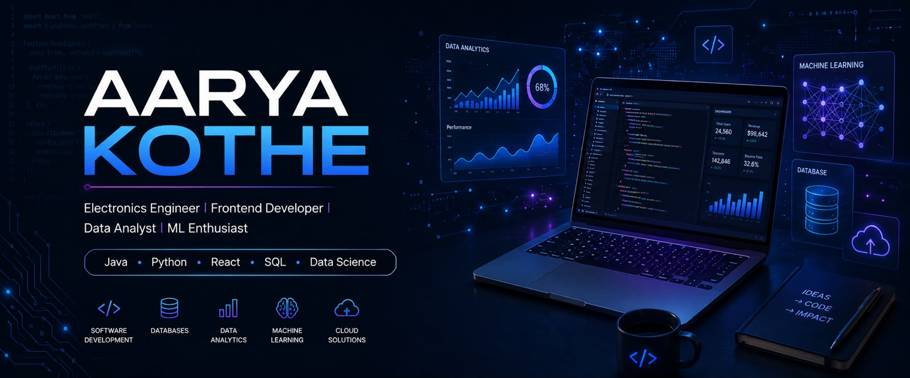

<h1 align="center">Hi 👋 I'm Aarya Kothe</h1>

<h3 align="center">
🚀 Electronics Engineer | Frontend Developer | Data Analyst | ML Enthusiast
</h3>

 

  

# 🚀 About Me

Hello! I'm **Aarya Kothe** 👋

I am an **Electronics Engineer and Software Developer** passionate about building modern applications, analyzing data, and solving real-world problems using technology.

My areas of interest:

💻 Frontend Development  
📊 Data Analytics & Data Visualization  
🤖 Machine Learning Fundamentals  
🗄️ SQL & Database Management  
⚡ Data Structures & Algorithms  
🌐 Software Development  

I enjoy creating:

✨ Interactive Web Applications  
✨ Data Analytics Dashboards  
✨ Machine Learning Projects  
✨ Efficient Algorithms & Solutions  

Currently improving my skills in:

🚀 Advanced Java  
🚀 Full Stack Development  
🚀 Machine Learning  
🚀 System Design  
🚀 Cloud & Deployment  

 

---

# 💻 Tech Stack

## 🚀 Programming Languages

---

## 🌐 Frontend Development

Skills:
---

# 🚀 Featured Skills & Strengths

<table>

<tr>

<td align="center" width="25%">

 

<b>Frontend Development</b>

 

Creating modern, responsive and user-friendly interfaces

</td>

<td align="center" width="25%">

 

<b>Data Analytics</b>

 

Transforming raw data into meaningful insights

</td>

<td align="center" width="25%">

 

<b>Machine Learning</b>

 

Building predictive and intelligent solutions

</td>

<td align="center" width="25%">

 

<b>Databases</b>

 

Designing efficient data storage solutions

</td>

</tr>

</table>

---

# 📌 Currently Working On

🚀 Building Advanced Frontend Projects  

📊 Developing Interactive Analytics Dashboards  

🤖 Exploring Machine Learning Applications  

🧠 Improving Data Structures & Algorithms  

---

# 📊 GitHub Analytics

 

---

# 🐍 My Coding Journey

---

# 🏆 Developer Mindset

 

> 💡 "Great software is built by continuous learning, creativity, and solving real-world problems."

---

# 🌐 Let's Connect

---

### ⭐ Thanks for visiting my profile!

  

